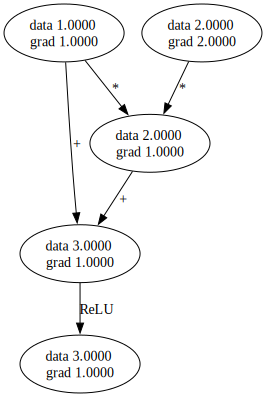

<div align="center">
  
This project was originally my [bachelor thesis](https://kth.diva-portal.org/smash/record.jsf?pid=diva2%3A1985858&dswid=8459), the code used is preserved in the [thesis](https://github.com/21st-centuryman/micrograd-rs/tree/thesis) branch.

</div>
<div align="center">

## Micrograd

[]()
[]()
<br>


</div>

## ⇁  Welcome

This is a thesis project to rewrite the [micrograd](https://github.com/karpathy/micrograd) framework by Andrej Karpathy to Rust. The purpose of this thesis is to discuss memory allocation of micrograd when rewritten in the Rust programming language. I looked over the limitations of writing the project similarly to Rust and how it can be improved to focus on stack allocation (which I will implement in the micrograd_v2). The report will be added to this project once it is published.

## ⇁  Example usage

```rs
let a = Value::from(-4.0);
let b = Value::from(2.0);
let mut c = &a + &b;
let mut d = &a * &b + b.pow(&Value::from(3.0));
c = &Value::from(2.0) * &c + Value::from(1.0);
c = Value::from(1.0) + &Value::from(2.0) * &c + (-&a);
d = &d + &(&d * &Value::from(2.0)) + (&b + &a).relu();
d = &d + &(&Value::from(3.0) * &d) + (&b - &a).relu();
let e = &c - &d;
let f = e.pow(&Value::from(2.0));
let mut g = &f / &Value::from(2.0);
g = g + &Value::from(10.0) / &f;
println!("{:.4}", g.data.borrow()); // prints 24.7041
g.backward();
println!("{:.4}", a.grad.borrow()); // print 138.8338
println!("{:.4}", b.grad.borrow()); // print 645.5773
```

## ⇁  Tracing / Visualization

We also implemented a draw_dot function that will act similarly to graphviz and digraph. This will allow us to visualize each node, showing both their data and gradient. An example below shows how to run it. Also `trace_graph.ipynb` shows how to achieve this using [evxcr jupyter kernel](https://github.com/evcxr/evcxr/blob/main/evcxr_jupyter/README.md)

```rust
use micrograd::engine::Value;
use micrograd::nn::Neuron;
let x = Value::from(1.0);
let y = (x * Value::from(2) + Value::from(1)).relu();
y.backward();
draw_dot(y);
```



## ⇁  Training a neual net

We are also able to create more advanced neural nets, such as a 2-layer MLP binary classifier. 
The code for the make moons implementation is in the examples folder.


## ⇁  Running tests

All tests are in the `tests` folder. You can run them with the following command.

```console
cargo test
```

## ⇁  License

MIT
</div>
